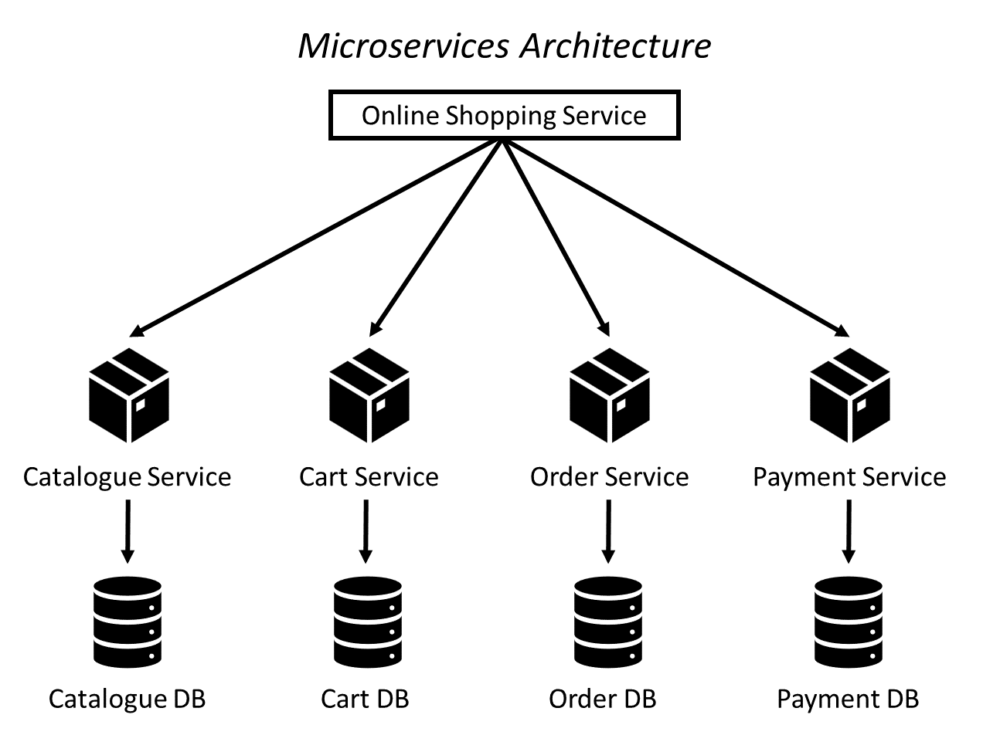

# Microservices

## What is Microservices Architecture?

Microservices architecture is an architectural style that structures an application as a collection of small, independent, and loosely coupled services. In this approach, the application is divided into multiple individual services, each responsible for a specific business capability. These services can be developed, deployed, and scaled independently, allowing for greater flexibility, modularity, and maintainability of the overall system.

## Microservices Use Cases

Microservices architecture allows for independent development, deployment, and scalability of individual services, making it ideal for the following use cases:

- Scalable web applications
- Enterprise applications
- E-commerce platforms
- IoT applications
- Mobile applications
- DevOps and continuous delivery

## Benefits of using Microservices

- **Scalability:**  Independent scaling of services for efficient resource allocation.

- **Agility and Faster Time-to-Market:**  Independent development and deployment for parallel work and quick feature releases.

- **Modularity and Maintainability:** Easier understanding, development, and maintenance with focused services.

- **Fault Isolation and Resilience:** Prevents service failures from affecting the entire application.

- **Technology Flexibility:** Freedom to choose suitable technology stacks for each service.

- **Scalable Team Collaboration:** Team autonomy, decentralized decision-making, and faster development cycles.

- **Continuous Delivery and DevOps:** Facilitates frequent deployments and streamlined software development lifecycle.

## Disadvantages of using Microservices

- **Increased Complexity:** Microservices introduce higher complexity due to managing multiple services and their communication.

- **Distributed System Management:** Managing and monitoring a distributed system of microservices can be challenging.

- **Operational Overhead:** Microservices may require additional operational tasks such as deployment, monitoring, and orchestration.

- **Service Dependency:** Services may have dependencies on other services or external APIs, leading to versioning and compatibility challenges.

- **Increased Development Effort:** Developing and maintaining a microservices-based system can require more effort compared to a monolithic architecture.

- **Deployment and Infrastructure Complexity:** Deploying and managing multiple services across different environments can be complex.

- **Learning Curve:** Adopting microservices may require learning new technologies and architectural patterns.

## When may Microservices not be suitable?

- Small, simple applications with limited functionality and resources.

- Tight deadlines or resource constraints that don't allow for the additional effort and coordination of microservices.

- Applications with high inter-service communication or complex dependencies, where a monolithic architecture may be simpler.

- Legacy systems or dependencies that are challenging to decouple into microservices.

- Limited DevOps and infrastructure capabilities to effectively manage microservices.

- Rapidly changing requirements that may lead to unnecessary rework when using microservices.

## Case Studies

- **Netflix:** Netflix use a highly distributed architecture consisting of hundreds of microservices that handle different functionalities, such as user recommendations, content delivery, and billing.

- **Amazon:** Amazon has embraced microservices architecture for its various services, including Amazon Prime, Amazon AWS, and Amazon Marketplace. They have a scalable and loosely coupled architecture that allows them to handle millions of transactions per day.

- **Uber:** Uber has implemented microservices to power its ride-sharing platform. Each microservice handles a specific function, such as user authentication, ride matching, payment processing, and driver tracking.

- **Spotify:** Spotify uses microservices to deliver its music streaming service. They have a modular architecture where microservices handle different aspects like user authentication, music recommendation, playlist management, and streaming.

- **Airbnb:** Airbnb employs microservices to power its online marketplace for lodging and tourism experiences. Each microservice focuses on a particular domain, such as property listings, bookings, payments.

## Monolith vs Two-tier Architecture vs Microservices

Monolithic architecture builds the application as a single unit, while two-tier architecture has a client-side user interface interacting directly with a server-side application or database. Microservices architecture divides an application into small, independent services for flexibility and scalability.

## What is Docker?

Docker is an open-source platform for automating application deployment, scaling, and management using containerisation. Containers are lightweight, isolated environments that package an application and its dependencies. Docker allows you to create and manage containers, ensuring consistency across different environments.

### Docker key components

- **Docker Image:** A lightweight software package with everything needed to run an application.

- **Docker Container:** A running instance of an image, providing an isolated environment for an application.

- **Dockerfile:** Instructions to build an image, including code, dependencies, and configurations.

- **Docker Registry:** A repository for Docker images, like Docker Hub for pre-built images or private registries for custom images.

- **Docker Compose:** Tool for managing multi-container applications, simplifying configuration and dependencies in a YAML file.

## Docker Use Cases

Docker offers versatility and efficiency across a range of application deployment and management scenarios such as:

- **Application Deployment and Portability:** Simplifies application packaging and deployment across different platforms.

- **Microservices Architecture:** Enables scalable and isolated components in a distributed system.

- **Continuous Integration and Deployment (CI/CD):** Automates build, test, and deployment processes for efficient software delivery.

- **DevOps and Infrastructure Automation:** Supports standardized environments and automates infrastructure provisioning.

- **Hybrid and Multi-Cloud Deployments:** Facilitates portability and flexibility across multiple cloud providers.

- **Scalable Web Applications:** Enables efficient scaling of containers to handle increasing traffic loads.

- **Testing and QA Environments:** Creates isolated and reproducible testing environments.

- **Big Data and Analytics:** Provides isolated environments for running data processing pipelines.

- **Desktop Virtualisation:** Enables application isolation and management on desktop machines.
