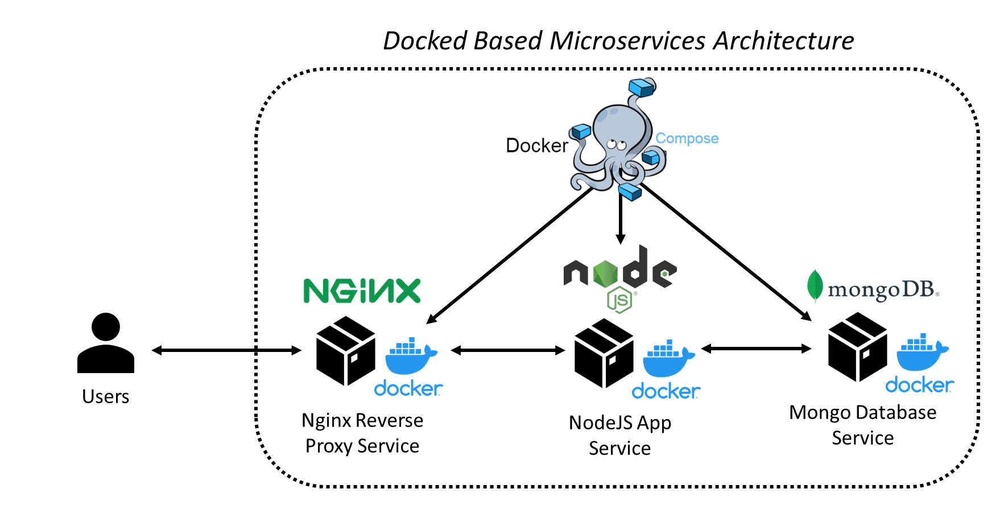
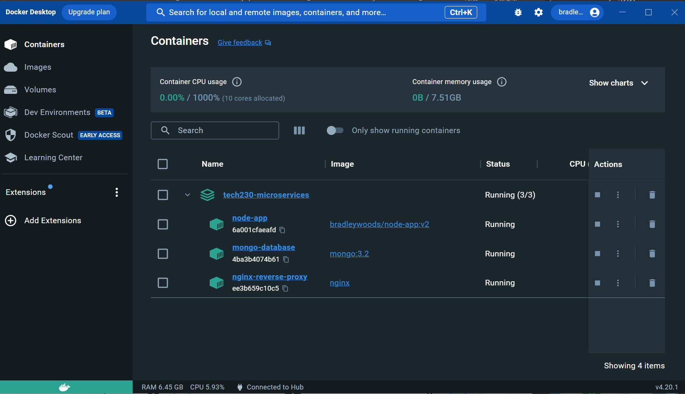

# Microservices using Docker Compose

This guide outlines how to use Docker Compose to orchestrate each container's service to launch the NodeJS application, the Mongo database and run Nginx as a reverse proxy using Docker Compose as shown [here](https://github.com/bradley-woods/tech230-microservices/blob/main/docker-compose.yml).



- **Nginx Reverse Proxy:** This service runs an Nginx reverse proxy using the official `nginx` image. It is accessible on port 80 and depends on the `node-app` service. It mounts the `default.conf` file from the local directory.

- **NodeJS App:** This service runs a Node.js application using the `bradleywoods/node-app:v2` image. It is accessible on port 3000 and depends on the `mongo-database` service. It also has an environment variable `DB_HOST set to mongodb://mongo-database:27017/posts`.

- **Mongo Database:** This service runs a MongoDB database using the `mongo:3.2` image. It is accessible on port 27017. It mounts the `mongod.conf` file from the local directory.

1. The first step is to create a 'docker-compose.yml' file which outlines each services and declares the state of each using the YAML language.

2. The next step is to ensure you have your images for the app, database etc.

3. Start creating 'docker-compose.yml' by outlining the version of Docker Compose:

    ```yaml
    version: '3'
    ```

4. Then outline the different microservices, starting with the NodeJS app. The `image` is defined as a custom image, then a `container_name` is given, `restart` is set to always to restart if a container stops, `ports` are set to 3000 as the application runs on this and we want to expose them on our localhost, an `environment` variable is set to communicate to the database and `depends_on` is set to prioritise the database first.

    ```yaml
    services:
    # Setting up NodeJS application service using existing image of the app
      node-app:
        image: bradleywoods/node-app:v2
        container_name: node-app
        restart: always
        ports:
          - "3000:3000"
        environment:
          - DB_HOST=mongodb://mongo-database:27017/posts
        depends_on:
          - mongo-database
    ```

5. The next service to create is the Mongo database as shown below. This uses the official Mongo version 3.2 `image`, allocates `ports` 27017, the default Mongo port, and mounts the `volumes` configuration file from a local directory to the containers `/etc` directory.

    ```yaml
      # Setting up Mongo database service using official Mongo 3.2 image
      mongo-database:
        image: mongo:3.2
        container_name: mongo-database
        ports:
          - "27017:27017"
        volumes:
          - ./mongod.conf:/etc/mongod.conf
    ```

6. The last service is to create Nginx reverse proxy using the following code.

    ```yaml
    # Setting up Nginx reverse proxy service using official Nginx image
      nginx-reverse-proxy:
        image: nginx
        container_name: nginx-reverse-proxy
        restart: always
        ports:
          - "80:80"
        volumes:
          - ./default.conf:/etc/nginx/conf.d/default.conf
        depends_on:
          - node-app
    ```

7. Finally, to run this container stack of 3 microservices, use the following command:

    ```bash
    $ docker compose up
    ```

    

8. To remove the entire container stack use the command:

    ```bash
    $ docker compose rm
    ```
