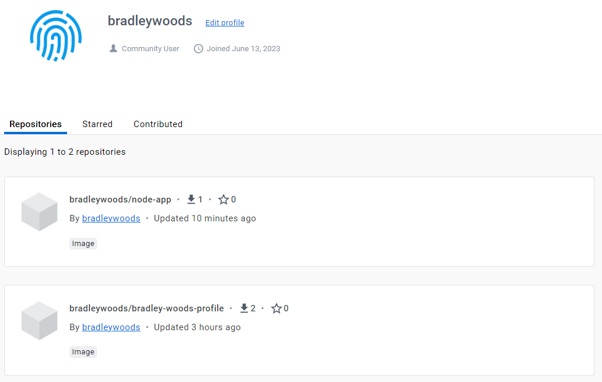

# Containerisation using Docker

This guide will outline how to use Docker to create images (templates) that can be used to run a container of an Nginx web server displaying a profile page and also run a container of the NodeJS sample web app.

Pre-requisites:

- Download and install [Docker Desktop](https://www.docker.com/)

## Running Docker Images

1. Use the `docker run` command to run the official Nginx image, whereby if Docker cannot find the image locally it will download it automatically from Docker Hub

    ```bash
    $ docker run -d -p 80:80 --name <container-name> nginx
    ```

    > **Note:** for Windows users you need to run the following command to allow you to log into the container:
    >
    > `$ alias docker="winpty docker"`

2. Now, if you go to 'localhost:80' on your browser, you should see the default Nginx welcome page.

3. To log into the running container to configure Nginx, we can use the following command:

    ```bash
    $ docker exec -it <container-id/name> sh
    ```

4. Once inside the container, we can use the following shell commands to edit the 'index.html' file to display new contents:

    ```bash
    $ apt update -y

    $ apt upgrade -y

    $ apt install sudo -y

    $ sudo apt install nano -y

    $ cd /usr/share/nginx/html

    $ sudo nano index.html

    $ exit
    ```

5. Also, we can stop and remove the container using the following:

    ```bash
    $ docker stop <container-id/name>

    $ docker rm <container-id/name> -f
    ```

6. Alternatively, we can replace the 'index.html' file with a new 'index.html' file to display our profile, without logging into the container, using the following command:

    ```bash
    $ docker cp index.html <container-name>:/usr/share/nginx/html
    ```

## Building Images using Dockerfile

1. To automate the process of creating a custom image that runs our profile 'index.html' we can create a 'Dockerfile' which is a series of commands to carry out when creating the image.

    ```bash
    $ sudo nano Dockerfile
    ```

2. The 'Dockerfile' to run a profile page on Nginx web server should look something similar to the below:

    ```docker
    # Use official Nginx image as base image
    FROM nginx

    # Label it with your name
    LABEL MAINTAINER=bradleywoods

    # Copy index.html to container Nginx html folder
    COPY index.html /usr/share/nginx/html/

    # Expose Port 80 on container
    EXPOSE 80

    # Launch the app/server
    CMD ["nginx", "-g", "daemon off;"]
    ```

3. Alternatively, we can create a 'Dockerfile' to build an image to run the sample NodeJS application:

    ```docker
    # Use official Node image as base image
    FROM node

    # Label it with your name
    LABEL MAINTAINER=bradleywoods

    # Create and navigate to app folder
    WORKDIR /usr/src/app

    # Copy app folder contents to container app folder
    COPY app /usr/src/app

    # Expose Port 3000 on container
    EXPOSE 3000

    # Launch the app/server
    CMD ["node", "app.js"]
    ```

4. We can now `build` and `run` our image using the 'Dockerfile' to tell Docker to execute the commands listed inside:

    ```bash
    $ docker build -t <namespace/repository-name> <Dockerfile-location>

    $ docker run -d -p <port>:<port> <namespace/repository-name>
    ```

    > **Note:** `-d` to detach from the terminal and run container in background. `-p` to publish the container's port to the host, e.g. to bind port 8080 of the container to TCP port 80 on localhost use `-p 127.0.0.1:80:8080/tcp`

5. Finally, to push the images to our Docker Hub, we can `login` using our account's username and password. Then, we can use the `push` command to push our image to a new repository under our username and specifying a repository name.

    ```bash
    $ docker login

    $ docker push <namespace/repository-name>
    ```

    
