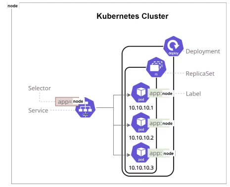
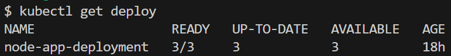
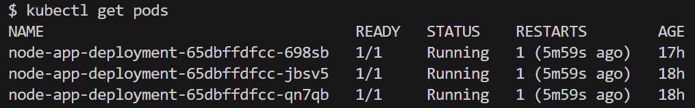
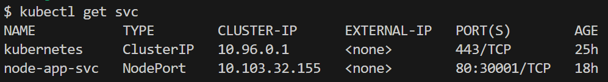
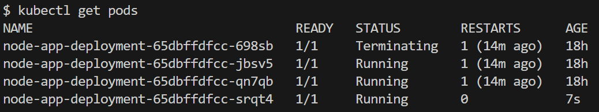
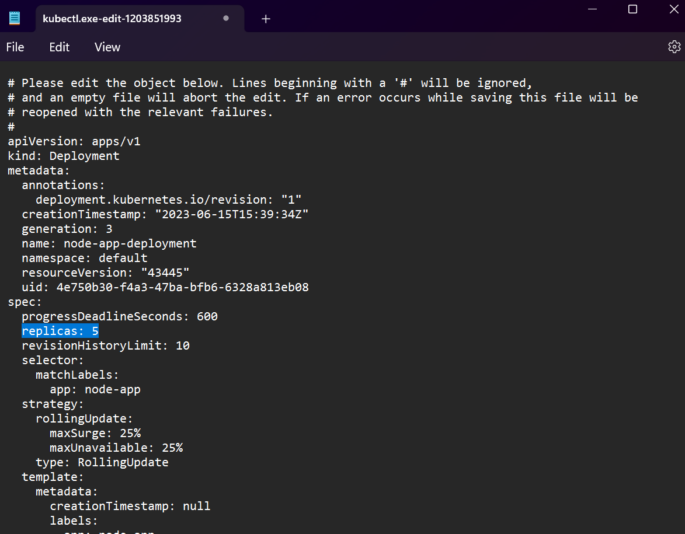
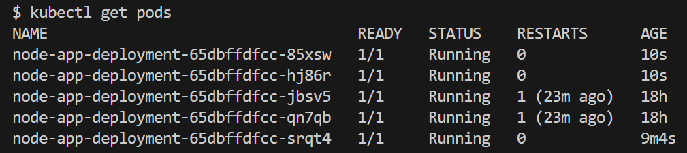

# Kubernetes Deployment and Services <!-- omit from toc -->

- [Creating the Deployment](#creating-the-deployment)
- [Creating the Service](#creating-the-service)
- [Self-healing using Kubernetes](#self-healing-using-kubernetes)
- [Scalability using Kubernetes](#scalability-using-kubernetes)

This guide explains how to deploy an application using a **Kubernetes Deployment** with 3 replicas, ensuring high availability.

It also demonstrates the creation of a **Kubernetes Service** that exposes the application on port 80, using a NodePort type to forward traffic from port 30001 on each node to the application's port 3000. To connect, the service and deployed pods, K8s uses labels to easily match and link them instead of having to remember each individual IP address.

The guide showcases Kubernetes' self-healing feature by automatically replacing any downed Pods, and it demonstrates scalability by increasing the replica count to 5 without interrupting the application's availability.



## Creating the Deployment

1. Firstly, create a YAML file for the deployment of the app as shown below. This `Deployment` will create and manage Pods with the label `app: node-app`, running the specified NodeJS application image on port 3000. The `Deployment` will ensure that there are always 3 replicas of the Pods running.

    ```yaml
    apiVersion: apps/v1 # Specifies the API version to use
    kind: Deployment # Specifies the kind of object to create, in this case, a Deployment                         
    metadata:
      name: node-app-deployment # The name of the Deployment                 
    spec:
      selector:
        matchLabels:
          app: node-app # Selects Pods with labels matching "app: nginx"
      replicas: 3 # Creates a replica set with 3 instances/pods                        
      template: # Specifies the template for creating Pods                               
        metadata:
          labels:
            app: node-app # The labels for the Pods created from this template                       
        spec:
          containers: # Specifies the containers to run in the Pod                     
          - name: node-app # The name of the container                     
            image: bradleywoods/node-app:v2 # The image to use for the container
            ports:
            - containerPort: 3000 # Specifies the port to expose on the container
    ```

2. Next, deploy the pods using that file and the following command:

    ```bash
    kubectl create -f <deployment-filename>
    ```

3. To check the Deployment and the running Pods in your cluster use the following commands:

    ```bash
    kubectl get deploy
    ```

    

    ```bash
    kubectl get pods
    ```

    

## Creating the Service

1. The next step is to create the YAML code to define a Kubernetes Service in the `default` namespace. It exposes a set of Pods labeled `app: node-app` on port 80. The Service is of type `NodePort`, and it listens on port 30001 on each node in the cluster, forwarding traffic to port 3000 on the Pods running the app.

    ```yaml
    apiVersion: v1 # Specifies the API version to use
    kind: Service # Specifies the kind of object to create, in this case, a Service                         
    metadata:
      name: node-app-svc # The name of the Service
      namespace: default # Specifies the namespace in which the Service should be created                 
    spec:
      ports:
      - nodePort: 30001 # Specifies nodePort for Service (range: 30000-32768)
        port: 80 # The port on which the Service will listen
        targetPort: 3000 # The port on the Pods to which the Service will forward traffic
      selector:
        app: node-app # Selects Pods with labels matching "app: nginx"
      type: NodePort # Specifies the type of Service, in this case, NodePort
    ```

2. Next, create the service using the following command:

    ```bash
    kubectl create -f <service-filename>
    ```

3. To check the service is running use the following command:

    ```bash
    kubectl get svc
    ```

    

## Self-healing using Kubernetes

1. If a Pod gets destroyed or it goes down, K8s will automatically create a new one in its place to meet the replica count. You can try and delete a pod using the following command:

    ```bash
    kubectl delete pod <pod-name>
    ```

2. Now, when we get the pod information, one is automatically running even before the old pod has finished being terminated:

    ```bash
    kubectl get pods
    ```

    

## Scalability using Kubernetes

1. We can easily scale the pods with zero-downtime by editing the configuration file using the following command:

    ```bash
    kubectl edit deploy <deployment-name>
    ```

2. Now we can edit the number of replicas, for example changing it from 3 to 5:

    

3. Now, when we get the pod information, we can see 5 pods are running instead of the previous amount of 3. If we was to refresh the web application during this time, we would also see zero-downtime.

    ```bash
    kubectl get pods
    ```

    